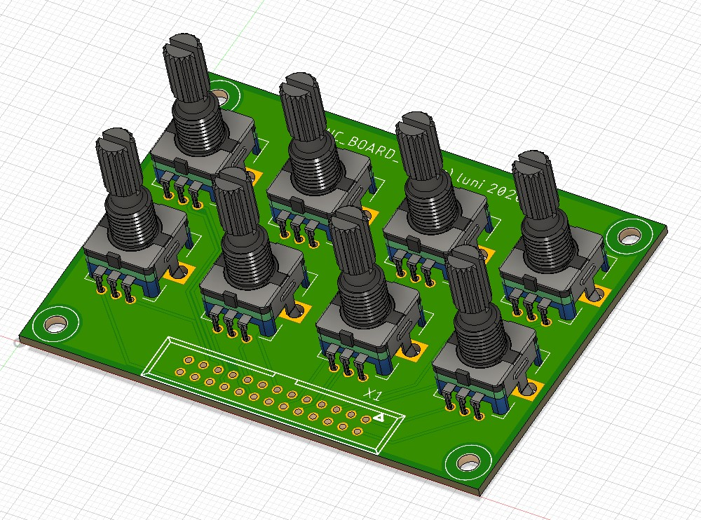
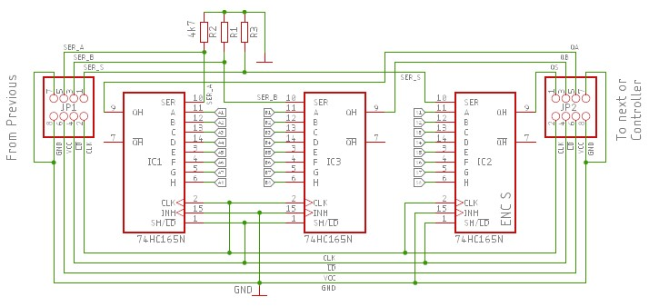
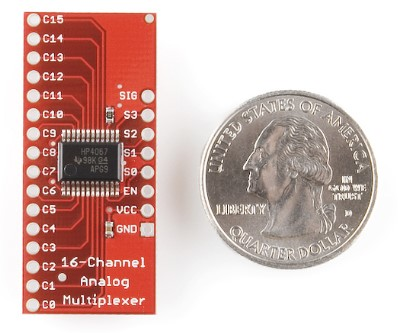
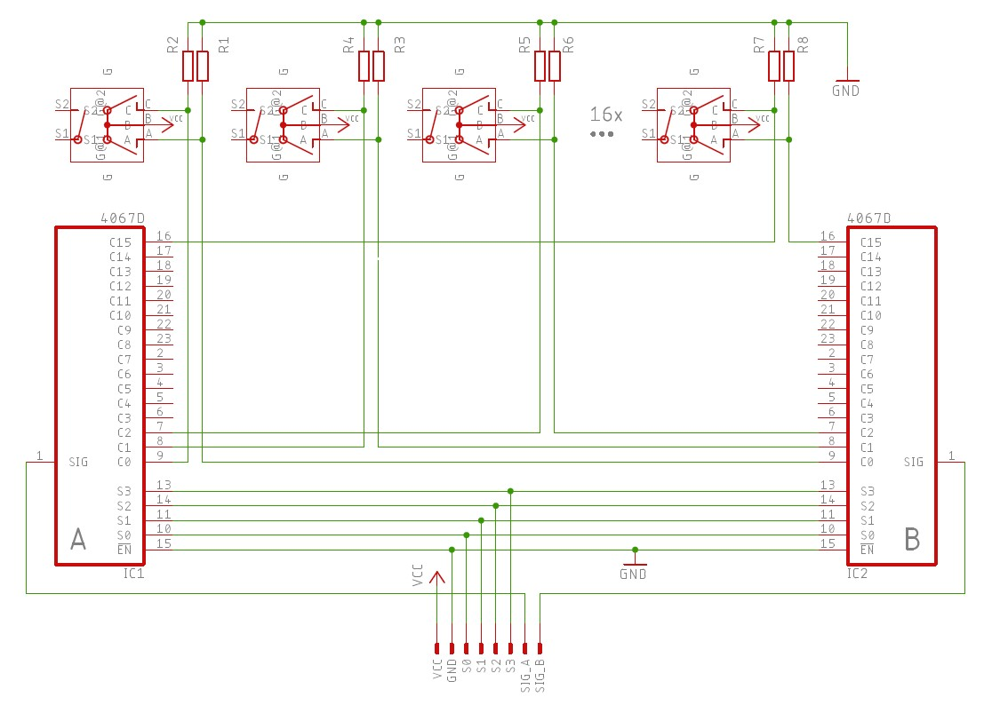
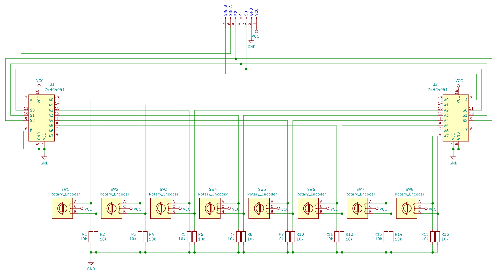
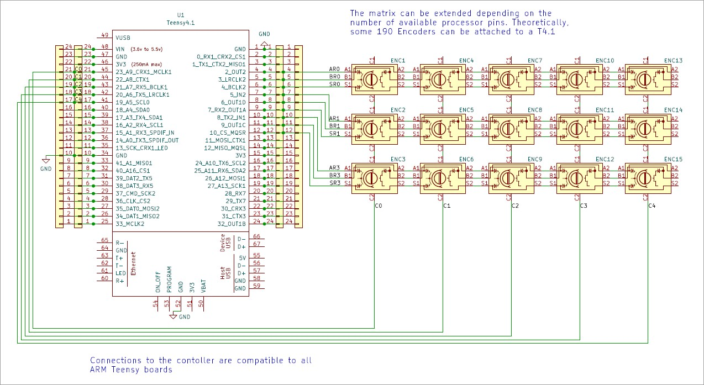
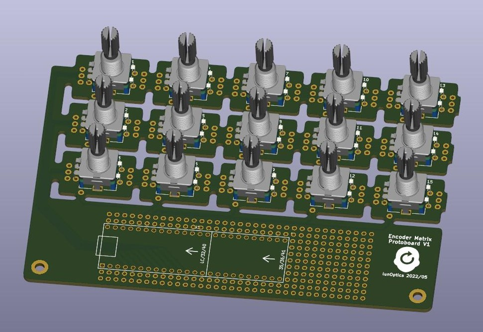
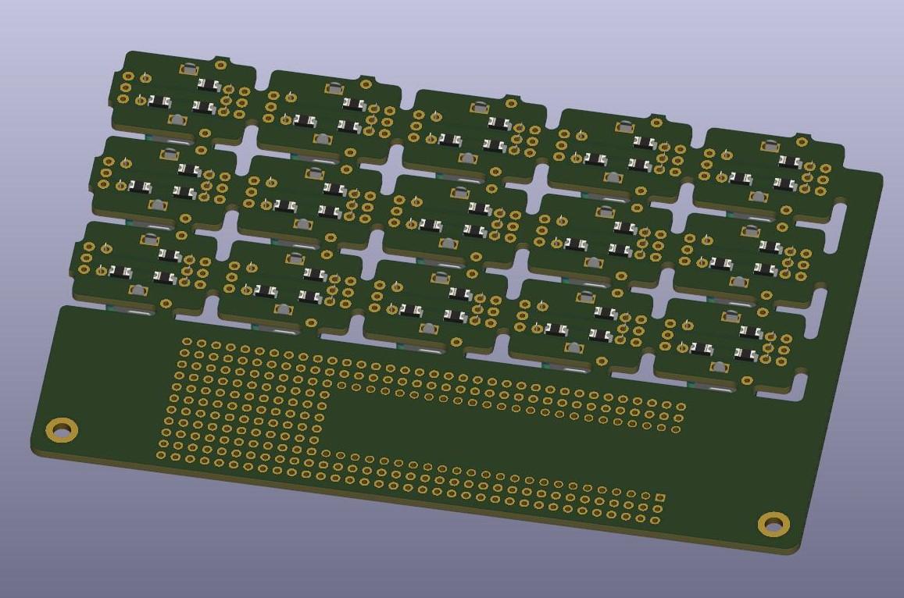

# Test Boards

This folder contains proposals and information how to use a 74HC165 shift register or the CD74HC4062 to multiplex rotary encoders. It also contains and a small encoder test board for up to 8 encoders.

<!-- vscode-markdown-toc -->
* [Encoder Board](#EncoderBoard)
* [Multiplexing with 74HC165](#Multiplexerwith74HC165)
* [Multiplexing with CD74HC4067](#MultiplexerwithCD74HC4067)
* [Multiplexing with CD74HC4051](#MultiplexerwithCD74HC4051)
* [Using a directly connected Encoder Matrix](#EncoderMatrix)

<!-- vscode-markdown-toc-config
	numbering=false
	autoSave=true
	/vscode-markdown-toc-config -->
<!-- /vscode-markdown-toc -->

## Encoder Board

Test board for 8 encoders with or without pushbuttons. The layout is done for the common 5mm [footprint](Boards/ENCODER_BOARD/footprint.jpg).

Overview:

- Schematic: [ENC_BOARD_V0.1.pdf](Boards/ENCODER_BOARD/Schematic.pdf)
- Gerbers: [CAMOutputs.zip](Boards/ENCODER_BOARD/Eagle/CAMOutputs.zip)

- BOM: https://octopart.com/bom-tool/XXf3nZh4

Assembly:\

Dimensions:\

## Multiplexing with 74HC165

Multiplexer for 8 encoders with or without additional pushbuttons using two (three) [74HC165](https://octopart.com/search?currency=USD&oq=74HC165+shift&q=74HC165+shift+register&specs=1&case_package=PDIP&case_package=DIP&rohs=Compliant) shift registers.

The following schematic shows the circuit idea. The two phases A and B of up to 8 encoders are connected to the inputs A-H of the first two shift registers. The optional pushbuttons are connected to the inputs of the third shift register.
The controller will use the common clock and load signals to read in the encoders  one after the other. For each encoder it calculates the new encoder count based on the old and the new phases A/B and pushbutton state S. The full schematic of the test board can be found [here](Boards/MPX_74165/MPX_74165_Schematic.pdf).

The board can be daisy chained if you need more than 8 encoders.

### Please note:
The 74HC165 shifts the encoders in from H to A. Thus, if you have less than 8 encoders connect them to H,G...  instead of A,B...

Board:\

Assembly:\

Dimensions:\

- Schematic: [MPX_74165_Schematic.pdf](Boards/MPX_74165/MPX_74165_Schematic.pdf)
- Gerbers: [CAMOutputs.zip](Boards/MPX_74165/Eagle/CAMOutputs.zip)
- BOM: https://octopart.com/bom-tool/vhNEkctc

## Multiplexing with CD4067

The [CD4067](http://www.ti.com/product/CD4067B) is a wide spread and easy to use 16 channel analog/digital multiplexer. Depending on the channel address which has to be supplied at the pins S0-S4, the multiplexer connects one of the 16 inputs C0-C15 to the common output SIG.
To multiplex rotary encoders we use two of the chips, one for the encoder phases A and one for phases B. If you want to use additional pushbuttons you can connect them to an additional multiplexer.

If you don't want to design a dedicated PCB, CD4067 breakout boards are readily available e.g. at SparkFun https://www.sparkfun.com/products/9056.

\
([CC BY 2.0](https://creativecommons.org/licenses/by/2.0/) SparkFun)

The schematic below shows the principle (not all encoders drawn). The pin names are chosen to match the print on the breakout boards.

If you use the breakout boards they can be assembled in the very compact way shown in the drawing below.

Extending the assembly to a third board to connect the encoder pushbuttons is straight forward.

## Multiplexing with CD4051

The [CD4051](http://www.ti.com/product/CD4051B) is an 8 channel analog/digital multiplexer, available in through-hole and SMD packages. Depending on the channel address which has to be supplied at the pins S0-S2, the multiplexer connects one of the 8 inputs to the common output.

To multiplex rotary encoders we use two of the chips, one for the encoder phases A and one for phases B. If you want to use additional pushbuttons you can connect them to an additional multiplexer.

The recommended through-hole component is the CD74HC4051. There's an older CD4051B available, but it is too slow to accurately read multiple encoders without significantly slowing down the scanning speed.

The schematic below shows how to connect your encoders and multiplexers ([full PDF](Boards/MPX_4051/MPX_4051_Schematic.pdf)). 3.3V from the Teensy is used to supply VCC.

## Using a directly connected Encoder Matrix

Instead of using external multiplexers one can use a Teensy to read out\
a matrix of encoders.

Here a schematic and 3d views of a corresponding prototype board
([full PDF](Boards/MATRIX/documentation/schematic.pdf)).\
The controller sets one column pin at a time to HIGH and queries\
the A/B/S pins of the individual rows.

The board can be used for prototypes as well as finished products.\
To accommodate the final, mechanical setup the rows and columns\
can be broken apart. Wiring of the singled encoder boards is easy using\
the provided pads. The layout of the board allows to use a Teensy or\
similar board as controller.

Front

Back

Production files (gerbers, drill files) can be found in the extras folder.